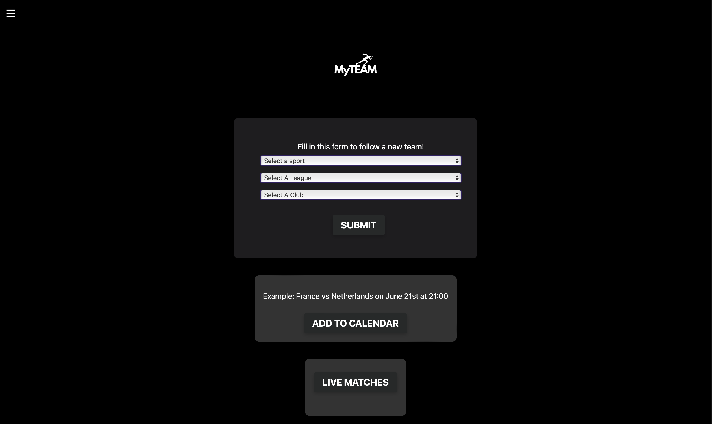

# Project Title

## Brief description of the project
MYTEAM is your all-in-one solution for tracking and managing your team's (and personal) games. Follow your favorite teams and add matches you are interested in to your calendar. On the home page, you can easily select a professional team to follow. Choose your team based on the sport and tournament you’re interested in, and stay up-to-date by adding their games to your calendar or your personal game list.
In addition to following professional sports, you can create and track your own games. Organize matches with friends and share the events on your calendar, making it easier for everyone to stay informed. View all the games you've added in one place. If you no longer wish to follow a particular game or if you've made an error, you can easily delete the match from your list. There is also a live games section to see the games currently being played. A

## Team members
- Bastian Brinksma, bbr103
- Morris Nijland, mni105
- Denis Akmaikin dak201
- Bob Verniers, bvs207

## Installation details
1. Navigate with cmd or terminal to root folder of this repository (By copying the path of the repository folder and writing cd 'copied path' in the cmd).
2. Then install requirements.txt inside the root folder, you can do that by copying the list in the requirements.txt file and paste it after writing pip install -r in the cmd. 
3. While you are still in the same location of the root folder you can run the website by writing:
   python run.py (python3 may be necessary)
4. then open new tab where you will be able to find the website. ->  * Running on http://127.0.0.1:5000, that is the link to our website, copy it into your browser.

## Architecture
Home Page 
1. Select Sport -> Sport_name.  Sport_name = Database.Sport -> Sport_name_id
	Sport_name_id -> Sport.Teams, Sport.Games, etc

2. Select Player -> Team_name.  Team_Name = Database.Team ->Team_id
	Database.TeamName_id -> D.Team_stats (includes basic info and games.)

3. Select Top -> Rank of the opponent. Database.Team_rank = Database.Team_id1
	-> Team_id -> Followed_team, team_id1 = Opponent, 
	Database.Games -> Date,Team_id.
	Create Table: Followed ‘’vs’’ Opponent

4. Add chosen game to google calendar or 'my games'.

## Contribution.
We all had to work a bit together throughout the project, it wasn't that one person had to do everything by themselves. Bob and Morris started the backend together, later on Morris took charge with the details of the API implementation. Bob created the custom game and my games section of the website, allowing us to customize a local database with the users custom games, he also helped with some frontend stuff. Denis and Bastian led the frontend charge, also figuring out the backend of the log in page. We helped eachother a lot by doing group calls and coding together.

Bastian and Denis tried to implement a working login and signup system with a database, this database would also be useful to store user preferences later on but we only got it working on local servers. The signup system works on our localhost server. We tried different things to make it accesible through the files in github or to deploy the site online but we could not make the login system work because of the issues when making it accesible for non local computers. 

- Bastian Brinksma -> HTML, CSS, javascript for animations and other functions, PHP
- Morris Nijland -> HTML, Backend, API, java
- Denis Akmaikin (2755766) -> HTML, CSS, partial javascript for nav-bar and calendar , PHP,
- Bob Verniers (2727025) -> HTML, Backend, Calendar, java

